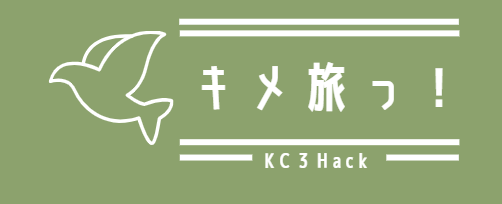

# キメ旅っ！

## チーム名

チーム23 不眠不休

---

## 背景・課題・解決されること

集団で旅行をする際、こんな悩みはありませんか？
**「1か月前から予定を聞いているのに、誰も回答してくれない...」**

これは旅行の主催者が必ず直面する「予定調整の壁」です。そこで私たちは、全く新しい解決策を提案します。

| 比較項目         | 従来の予定調整           | キメ旅っ！                       |
| :--------------- | :----------------------- | :------------------------------- |
| **対象時期**     | 1か月前など直近          | **強制的に3か月先**              |
| **調整方法**     | 空いている日をすり合わせ | **予定がない前提で日程をロック** |
| **参加者の手間** | 日程アンケートに複数回答 | **通知から「参加」をワンタップ** |

従来の1か月前の調整では全員の予定を合わせるのが困難ですが、3ヶ月前ならほとんどの人が予定を空けられます。旅行の発案段階から日程を仮置きし、スムーズに話を進めるための機能を詰め込みました。

---

## プロダクト説明

「キメ旅っ！」は、3ヶ月先の旅行日程を強制的にロックし、参加者の予定を確保する旅行計画アプリです。

1. **簡単な利用開始**: Googleログインで即座に利用登録完了。
2. **グループ作成と日程提案**: 一緒に行きたいメンバーでグループを作り、旅行計画を作成。※日程は「3か月先」しか入力できない仕様です！
3. **Push通知で即承認**: プロダクトが作成されると、招待された参加者にPush通知が届きます。
4. **追い通知機能**: めんどくさがって回答してくれないメンバーには、内容をカスタマイズした「追い通知」で直接リマインドが可能です。

### ✨ 【最大の目玉】予定の承認 ＝＞ 即、自分のカレンダーへ登録！ ✨

参加者がPush通知から旅行への参加を「承諾」すると、ICSファイルが生成されます。
これにより、**スマホのネイティブカレンダーにそのまま旅行の予定が自動追加**され、別のアプリを開いて予定をメモし直す手間は一切ありません！

---

## 操作説明・デモ動画

[デモ動画はこちら](https://www.youtube.com/watch?v=fbzGp0XJGq8)

---

## 注力したポイント

### ユーザー体験（UX）とアクセシビリティ

- **PWA (Progressive Web App) 対応**: どんなプラットフォームでも利用可能なWebアプリにしつつ、ホーム画面への追加やモバイルでのPush通知受信を実現しました。
- **フリクションレスな認証**: ユーザー名やアイコン画像の登録ステップを排除し、Googleログイン単体で完結する仕組みにしました。

### デザイン・UI

- **親しみやすいUI**: 普段から使い慣れたLINEと同様のフォントを採用し、ベースカラーを緑に統一しました。
- **完全レスポンシブ対応**: GRID（12カラム）を用いたコンポーネント設計により、画面サイズが変わっても可読性が落ちない工夫を施しています。

### インフラ・アーキテクチャ

- **ゼロコスト運用**: DB構築やサーバーホスティングなど、すべて0円で運用できるよう技術選定を行いました。

### その他（開発の裏側）

「これ実装終わるの？？？？」と途中で絶望しかけましたが……
=> **無事終わりそうです！！神!!!!**

---

## 使用技術

| カテゴリ                  | 使用技術                        |
| :------------------------ | :------------------------------ |
| **言語**                  | TypeScript                      |
| **フロント/バックエンド** | Next.js 16                      |
| **データベース**          | Neon (PostgreSQL)               |
| **ORM**                   | Prisma (v6)                     |
| **スタイリング**          | Tailwind CSS v4                 |
| **認証**                  | Auth.js (Google Authentication) |
| **通知機能**              | web-push                        |
| **コード管理**            | Git, GitHub                     |
